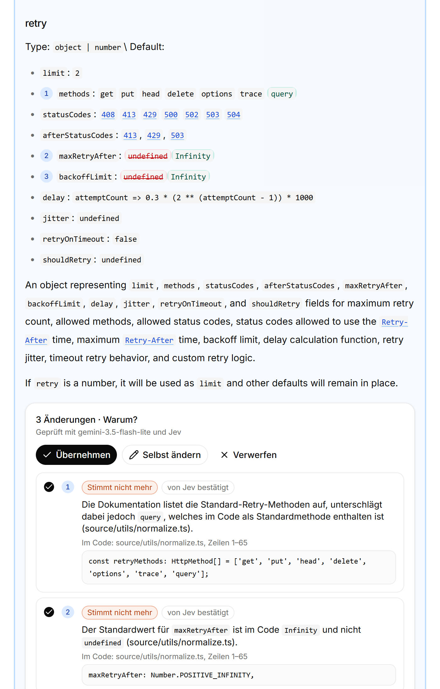

<p align="center">
  
</p>

<h1 align="center">neuraldoc</h1>

<p align="center">
  <b>Keep product documentation in step with the code.</b><br/>
  When the code changes, neuraldoc finds the documents that became outdated and drafts evidence-backed updates. A person approves every change.
</p>

<p align="center">
  <a href="https://github.com/neuraldoc-ai/neuraldoc-app/actions/workflows/ci.yml"></a>
  <a href="LICENSE"></a>
  
  
  
  
</p>

<p align="center">
  <a href="#get-started">Get started</a> ·
  <a href="#how-it-works">How it works</a> ·
  <a href="#configuration">Configuration</a> ·
  <a href="ARCHITECTURE.md">Architecture</a> ·
  <a href="CONTRIBUTING.md">Contributing</a>
</p>

Code changes every sprint, the manual, the dialog descriptions and the parameter lists do not. Drop in your repository and your documents: neuraldoc compares every section with the current code, shows each place where they disagree, and proposes the exact text change with the code that proves it.

- **Runs on your machine.** One Docker container: interface, API and MCP server. Your files are never modified.
- **Every proposal has evidence.** Each text change links to the code lines it is based on. If the evidence is missing, neuraldoc asks a question instead of guessing.
- **A person decides.** Nothing is published automatically. You accept, edit or reject each proposal and export the approved texts.
- **Bring your own model.** OpenAI, Claude, Gemini, Vertex AI or a local LLM via any OpenAI-compatible server.

<p align="center">
  
</p>
<p align="center">
  <em>Reviewing a proposal. The old sentence is struck through, the new one is green, the evidence (commit <code>d71c5e8</code>) is one click away.</em>
</p>

---

## Get started

**Requires:** [Git](https://git-scm.com/downloads) and [Docker](https://docs.docker.com/get-docker/). Nothing else on your machine.

```bash
git clone https://github.com/neuraldoc-ai/neuraldoc-app.git
cd neuraldoc-app
docker build -t neuraldoc .
docker run -p 8080:8080 -v neuraldoc-data:/data neuraldoc
```

Open **http://localhost:8080/app/**. The app starts empty: import your own project, or click **Beispielprojekt laden** to try it on a sample.

### Try the sample project

The sample is a fictional ERP vendor (MOBIQ) whose documentation is one release behind the code. It lives in its own repositories, [mobiq-code](https://github.com/neuraldoc-ai/mobiq-code) (code of release 26.4) and [mobiq-docs](https://github.com/neuraldoc-ai/mobiq-docs) (33 Confluence pages and 7 Office/PDF files of release 26.3). **Beispielprojekt laden** clones both from GitHub and treats them like your own project, so the initial check and the drafts use your keys. You can also clone the two repositories yourself and drop them into **Eigenes Projekt**.

### Check your own project

Open **Einstellungen** in the sidebar, enter your name and company, and paste your own keys: Jev (required) and one LLM (OpenAI, Claude, Gemini, Google Cloud Vertex AI or a local model). They are stored in the `neuraldoc-data` volume, apply immediately and are never sent back to the browser. Prefer environment variables? Pass `--env-file .env` (template: [.env.example](.env.example)); keys saved in the interface take precedence.

On the start page **Eigenes Projekt importieren**, later **Übersicht → Eigenes Projekt**:

| | How | Required |
|---|---|---|
| **Repository** | Drag the folder in, pick a folder or ZIP, or paste a GitHub URL | yes |
| **Documentation** | Drop PDFs, Word, Excel, PowerPoint, Markdown, text, HTML or Confluence pages (storage format, `.xml`), or paste a GitHub URL | no |

Without separate documentation, neuraldoc checks the READMEs, the `docs/` folder and the PDF and Office files inside the repository. `node_modules`, build output and `.env` files are filtered out in the browser before anything is uploaded.

A repository given by GitHub URL brings its Git history: every commit since the newest tag (the last release; without a tag the last 90 days). Merges become features with their branch commits, other commits are grouped by ticket key (e.g. `MOB-4812`). The overview and **Änderungen** then show each feature with its commits and the documents it affects, as in the showcase. An uploaded folder has no history; its findings appear as one change, the initial check.

**Daten** shows the repository in a code editor (files, search, history, merge requests, diffs), the documents as neuraldoc read them, and a database if there is one: the repository's SQL files run read-only in the browser (PGlite). **Datenbank verbinden** adds your own PostgreSQL, on your machine (`host.docker.internal` from inside the container) or at an internet address, with SSL. The password stays in the `neuraldoc-data` volume; every query runs in a read-only transaction, at most 15 seconds and 1,000 rows. Use a database user that may only read.

1. **Erstprüfung starten** compares every documentation section with the current code, as if the last release had just shipped. It takes a few seconds per section; the overview shows the progress.
2. Each section that no longer matches comes back with its correction: every change is marked in the text (only the words that change), numbered, and explained below with the code that shows it. Deletions say why the text has to go.
3. Accept all changes of a section, untick single ones, edit the text yourself or reject it; then **Freigaben exportieren** downloads a ZIP with the corrected documents.

<p align="center">
  
</p>

### Prepared showcase (no keys)

A separate image shows the MOBIQ sample with prepared drafts: no import, no keys, no model calls. It needs the dataset submodules.

```bash
git clone --recursive https://github.com/neuraldoc-ai/neuraldoc-app.git   # Windows: git -c core.autocrlf=false clone --recursive …
cd neuraldoc-app
docker build --target showcase -t neuraldoc-showcase .
docker run -p 8080:8080 neuraldoc-showcase
```

---

## See it in action

<table>
  <tr>
    <td width="50%"></td>
    <td width="50%"></td>
  </tr>
  <tr>
    <td><b>Overview.</b> Commits are grouped into features; each feature lists the documents it affects.</td>
    <td><b>One change.</b> The process before and after, and which kinds of documentation need an update.</td>
  </tr>
  <tr>
    <td></td>
    <td></td>
  </tr>
  <tr>
    <td><b>Company Brain.</b> Code, database, modules and documents in one graph. Solid edges are proven by the code, dashed ones are derived.</td>
    <td><b>Review.</b> Accept, edit or reject each passage. Approved wording is stored exactly as accepted.</td>
  </tr>
</table>

---

## How it works

```
repo + docs ──► code graph ──► initial check ─────────────────────────► your review ──► ZIP export
 (upload or      tree-sitter    per section: LLM findings with quotes,   accept, untick   corrected
  GitHub URL)    + SQL AST      server checks, second look, Jev; per     single changes,  documents
                                document: missing list entries           edit or reject
```

| Step | What happens | Cost |
|---|---|---|
| **Import** | Reads the code and the documents. PDF, Word, Excel and PowerPoint become text; every document is split into sections at its headings. Sections without prose (logos, badges, link lists) are not checked. A cloned repository's commits since the last release are grouped into features. | free, local |
| **Code graph** | Parses Java, Kotlin, TypeScript/TSX, Pascal (tree-sitter) and SQL (PostgreSQL parser) into files, functions, calls and tables. | free, local |
| **Initial check** | For every section, neuraldoc looks up the names it mentions (code spans, options, flags, environment variables) in the code and picks the matching code places, files the section names first. Your LLM lists the statements the code contradicts, the names that no longer exist and the entries a list leaves out, each with a literal quote from the section and the code, a reason and the line edits that fix it. The server keeps only what it can verify: quotes exist, a "removed" name really occurs nowhere in the code, edits change more than whitespace, keep the language and the Markdown format. A second look drops context mistakes (another server, an example value), [Jev](https://docs.typesafe.ai/api) confirms each finding and must confirm every deletion. Per document, a completeness pass compares documented options, settings or fields with the code that defines them. | paid (your LLM, about 0.01 USD per section; Jev a fraction of that) |
| **Review & export** | Every change is shown in place with its reason and code evidence. You take all, some or none, or edit the text. Approved sections are merged back into their documents; PDF and Office files come back as Markdown. The export lists the SHA-256 of every original. | free, local |
| **Pull request** | With GitHub connected, every approval or withdrawal rebuilds a neuraldoc branch on the base branch and keeps one pull request on it, like Dependabot or Renovate. The base branch is never written; commits a person adds to the branch stop neuraldoc from touching it. | free |

Every link in the graph is marked as **proven** (read from the code) or **derived** (from a model), so you always know what was found and what was guessed. Details: [ARCHITECTURE.md](ARCHITECTURE.md).

### For coding agents (MCP)

The same container serves an MCP endpoint at `http://localhost:8080/mcp` with three tools: `ticket_context` (before coding), `ask` (domain questions with sources) and `check_change` (documentation impact of a finished change).

```bash
claude mcp add --transport http neuraldoc http://localhost:8080/mcp \
  --header "Authorization: Bearer <token from the MCP page>"
```

Tools, prompts and token handling: [mcp/README.md](mcp/README.md).

---

## Configuration

Keys, provider and model are set in the app under **Einstellungen** (stored in `/data/settings.json`, file mode 600). All settings can also be passed as environment variables with `--env-file .env`; values saved in the interface win, and removing them there falls back to the environment. The template is [.env.example](.env.example).

| Variable | Purpose | Default |
|---|---|---|
| `TYPESAFE_API_KEY` | Jev, checks documents against the code. Required for your own projects. | none |
| `NEURALDOC_JEV_BUDGET_USD` | Spending cap per initial check (max 1 USD) | `0.25` |
| `NEURALDOC_GIT_TOKEN` | Personal GitHub token: imports private repositories by URL and, with *Contents* and *Pull requests* write access, opens pull requests (also in Einstellungen) | none |
| `NEURALDOC_GITHUB_APP_ID` / `NEURALDOC_GITHUB_APP_PRIVATE_KEY` / `NEURALDOC_GITHUB_APP_SLUG` | GitHub App that opens the pull requests as `<slug>[bot]`; Einstellungen creates one from a manifest. Takes precedence over the token | none |
| `NEURALDOC_GITHUB_PR` | `auto` (after every approval), `manual` (button on the overview) or `off` | `auto` |
| `NEURALDOC_GITHUB_PR_GROUP` | `repository` (one pull request per repository) or `document` (one per file) | `repository` |
| `NEURALDOC_GITHUB_BRANCH_PREFIX` / `NEURALDOC_GITHUB_LABELS` / `NEURALDOC_GITHUB_REVIEWERS` / `NEURALDOC_GITHUB_DRAFT_PR` | Branch prefix, labels and reviewers (comma-separated), `true` opens drafts | `neuraldoc/`, `documentation,neuraldoc`, none, `false` |
| `NEURALDOC_GITHUB_API_URL` | API of a GitHub Enterprise Server | `https://api.github.com` |
| `NEURALDOC_DRAFT_PROVIDER` | `openai`, `anthropic`, `gemini`, `vertex` or `local` | none |
| `NEURALDOC_LLM_MODEL` | Model used for drafting | provider default |
| `OPENAI_API_KEY` / `ANTHROPIC_API_KEY` / `GEMINI_API_KEY` (or `GOOGLE_API_KEY`) / `VERTEX_API_KEY` / `NEURALDOC_LLM_API_KEY` | Key for the chosen provider | none |
| `NEURALDOC_LLM_BASE_URL` | OpenAI-compatible server for `local` (Ollama, LM Studio, vLLM) | none |
| `NEURALDOC_MODE` | `showcase`: prepared MOBIQ sample only, no import, no model calls (set by the `showcase` image) | empty |
| `NEURALDOC_MCP_TOKEN` | Bearer token for the MCP endpoint | random per installation, shown on the MCP page |
| `NEURALDOC_USER_NAME` / `NEURALDOC_USER_COMPANY` / `NEURALDOC_USER_ROLE` | Your profile, shown in the sidebar and on approvals (also in Einstellungen) | empty |
| `NEURALDOC_CHECK_REVIEW` | `off` skips the second look of the initial check | on |
| `PORT` | Port inside the container | `8080` |

| Provider | `NEURALDOC_DRAFT_PROVIDER` | Example model |
|---|---|---|
| OpenAI | `openai` | `gpt-4.1-mini` |
| Claude | `anthropic` | `claude-haiku-4-5` |
| Gemini | `gemini` | `gemini-3.5-flash-lite` |
| Vertex AI | `vertex` | `gemini-3.5-flash-lite` |
| Local | `local` | `qwen2.5:7b` |

A local LLM on the same computer is reached from the container at `http://host.docker.internal:11434/v1` (Ollama), not `127.0.0.1`. On Linux add `--add-host host.docker.internal:host-gateway`. Provider details, cost rates and validation: [docs/llm-providers.md](docs/llm-providers.md).

---

## Privacy

- **Your files stay unchanged** unless you connect GitHub: then approved sections go into a pull request on a `neuraldoc/` branch, never straight into the base branch.
- **Uploads stay local.** The upload goes only to your own container; the temporary copy is deleted after the import. Secrets such as `.env` files and private keys are filtered out in the browser and again on the server.
- **What leaves your machine:** when you start the initial check, document sections and code excerpts go to your LLM provider, and the findings with their code excerpts to Jev (TypeSafe API). With a local LLM, only the Jev request leaves your machine. A GitHub URL is cloned directly from GitHub.
- **Beispielprojekt laden** clones two public GitHub repositories. The **showcase image** makes no external calls at all.
- **No telemetry**, no analytics, no tracking. Keys are read at runtime and never written to the image, the caches or the export.
- Projects, decisions, caches and database connections live in the Docker volume `neuraldoc-data`. **Einstellungen → Zurücksetzen** deletes all projects, or everything including profile, keys and database connections; `docker volume rm neuraldoc-data` deletes the volume.
- **Own databases** are only read: queries go from your container to the database you connect, never anywhere else.

neuraldoc is built for local use by one person or a small team. There is no user management; do not expose it on a public network.

---

## Limits

This is an early release. Known limits:

- Up to 1,500 code files (100 KB each), 400 documentation sections of about 6,000 characters, 200 MB per upload and 30 MB per document.
- Scanned PDFs without a text layer cannot be read. Images and diagrams in documents are not checked.
- Deep analysis for Java, Kotlin, TypeScript/TSX, Pascal and SQL; other languages are compared as plain text.
- Code places are found by the names a section mentions and by shared terms (BM25). A section that describes behaviour in entirely different words than the code can be missed.
- Measured on five projects with known answers ([mcp/eval/README.md](mcp/eval/README.md)): a README-only library (chalk), a long README (ky), a separate documentation repository (axios-docs), a Django app with database (linkding) and the MOBIQ sample. The check reports 67 to 92 % of the expected changes (must-have changes: 60 to 100 %), and on MOBIQ every reported section had an expected change. On neuraldoc's own repository with ten planted mismatches of ten different kinds it found 8, with 3 false alarms among 17 findings. Of about 40 findings checked by hand, none was wrong; some were trivial (an alternative name for a key). On neuraldoc's own documentation it reported 8 changes, none wrong, 4 of them trivial; without the second look it had been 17, 7 of them wrong.
- Overviews of internal flows (architecture prose) are the weak spot: the check sees only some code places and cannot tell what calls what.
- A check costs about 0.01 USD per section with `gemini-3.5-flash-lite` (0.1 USD for a short README, 0.5 USD for a documentation site with 60 sections). Repeating it costs nothing: answers are cached by content.
- Corrections keep the language of the section (German and English are checked) and its Markdown format.
- Jira, Confluence and SharePoint are not connected directly. Upload exported files or Confluence pages in storage format instead.

---

## Troubleshooting

<details>
<summary><b>The showcase image fails to build with missing <code>datasets/</code> files</b></summary>

Only the showcase needs the sample data, as Git submodules. Run `git submodule update --init` in the cloned folder and build again. The normal app (`docker build -t neuraldoc .`) builds without them.
</details>

<details>
<summary><b>Something fails and the app only shows a short message</b></summary>

Every start, import, check, draft and error is written to the container log, with the cause:

```bash
docker logs -f <container>        # or: Docker Desktop → Containers → neuraldoc → Logs
```

The first lines show whether the Jev key and the LLM provider are configured.
</details>

<details>
<summary><b>Import finds no code or no documents</b></summary>

Pick the top folder of the repository, the one with the source files. Without separate documentation, the repository needs a README, a `docs/` folder or PDF/Office files. A GitHub URL must be public, or set `NEURALDOC_GIT_TOKEN` for private repositories.
</details>

<details>
<summary><b>Certificate errors during <code>docker build</code> or when calling Jev / the LLM</b></summary>

A company proxy is replacing TLS certificates. Add its root certificate to the image (for example append it to `/etc/ssl/certs/ca-certificates.crt` in a derived Dockerfile) and set `NODE_EXTRA_CA_CERTS` to the PEM file.
</details>

<details>
<summary><b>Port 8080 is already in use</b></summary>

Map another host port: `docker run -p 9090:8080 …` and open `http://localhost:9090/app/`.
</details>

<details>
<summary><b>Changed keys have no effect</b></summary>

Keys saved under **Einstellungen** apply immediately and win over environment variables; remove them there to use `.env` again. Environment variables are read at start: stop the container and run it again, the volume keeps your data. **Einstellungen** shows whether Jev and the LLM are configured.
</details>

---

## Development

Without Docker you need Node.js 24 and pnpm (`corepack enable` installs the version pinned in `frontend/package.json`):

```bash
cd frontend
pnpm install
pnpm dev          # http://localhost:5173/app/, with hot reload
pnpm test         # backend tests, Jev and LLM mocked, no costs
pnpm build        # type check and production build
```

Keys for development go into `frontend/.env.local` (template: `frontend/.env.example`). Project layout, data flow and how the showcase is built: [ARCHITECTURE.md](ARCHITECTURE.md). The MOBIQ sample dataset: [docs/mobiq-showcase.md](docs/mobiq-showcase.md).

---

## Learn more

- [ARCHITECTURE.md](ARCHITECTURE.md): modules, data flow, state and the two modes
- [mcp/README.md](mcp/README.md): MCP tools and prompts for coding agents
- [mcp/DRAFTING.md](mcp/DRAFTING.md): how drafts are generated, validated and cached
- [mcp/CONNECTORS.md](mcp/CONNECTORS.md): target picture for Jira, Confluence, SharePoint, SQL and Azure connectors
- [docs/llm-providers.md](docs/llm-providers.md): provider setup, costs and local models
- [docs/mobiq-showcase.md](docs/mobiq-showcase.md): the fictional MOBIQ dataset and its maintenance
- [MAPPING_REPORT.md](MAPPING_REPORT.md): component mapping test on the showcase
- [CHANGELOG.md](CHANGELOG.md)

---

## Contributing

Contributions are welcome. See [CONTRIBUTING.md](CONTRIBUTING.md) for the setup, the test commands and what makes a good pull request. Please report security issues privately as described in [SECURITY.md](SECURITY.md). This project follows the [Code of Conduct](CODE_OF_CONDUCT.md).

## License

[MIT](LICENSE) © Delschad Jankir. The interface is based on an MIT-licensed template; its notice is in [frontend/LICENSE-DASHBOARD](frontend/LICENSE-DASHBOARD). Companies, people and contents in the showcase are fictional.
